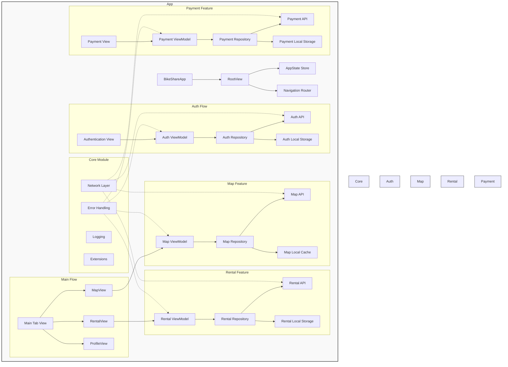

# 👋 HiBike 🚲
**너와 내가 만난 순간 새로운 출발이 시작**

## ⭐️ App Statement 
**사용자가 스테이션에 직접 돌아가지 않고도 원하는 위치에 자전거를 반납할 수 있도록 도와주자!**

### 💡 Solution 설명 
자전거를 대여한 후, 다른 장소에서 일시 잠금을 진행할 때 사용자는 자전거 소유권을 다른 사람에게 넘길 수 있는 옵션을 선택할 수 있습니다. 이 옵션을 선택하면, 자전거를 대신 사용할 지원자를 모집하게 됩니다.만약 지원자가 나타나면, 처음 대여한 사용자는 자전거의 소유권을 새로운 사용자에게 양도하며, 이후 자전거를 반납할 필요가 없습니다. 대신, 자전거를 넘겨받은 사용자가 자전거를 자유롭게 사용한 후, 기존 사용자가 대여한 충전 스테이션에 반납해야 합니다. 만약 지원자가 나타나지 않는다면, 기존 사용자가 자전거를 직접 반납해야 하는 구조입니다.

## 🧩 Team 
<table style="width: 100%; table-layout: fixed;">
  <tr>
    <td style="text-align: center; padding: 10px;">
      <h3>김리</h3>
    </td>
    <td style="text-align: center; padding: 10px;">
      <h3>마리</h3>
    </td>
    <td style="text-align: center; padding: 10px;">
      <h3>제이비</h3>
    </td>
    <td style="text-align: center; padding: 10px;">
      <h3>파인</h3>
    </td>
  </tr>
  <tr>
    <td style="text-align: center; padding: 10px;">
      
    </td>
    <td style="text-align: center; padding: 10px;">
      
    </td>
    <td style="text-align: center; padding: 10px;">
      
    </td>
    <td style="text-align: center; padding: 10px;">
      
    </td>
  </tr>
</table>

## 🚰 App Flow

## 📜 App Architecture

## 🐈‍⬛ Github Convention

### 이슈 종류

| 이슈 종류        | 설명                                                                                         |
|------------------|----------------------------------------------------------------------------------------------|
| `feat`     | **Feature**: 새로운 기능을 추가하거나 구현할 때 사용하는 이슈입니다. 예: 다크 모드 지원 추가.               |
| `bug`          | **Bug**: 예상과 다른 동작이나 코드 오류를 해결할 때 사용하는 이슈입니다. 예: 로그인 화면에서 앱 충돌.   |
| `enh`  | **Enhancement** 기존 기능을 개선하거나 확장할 때 사용하는 이슈입니다. 예: List 컴포넌트의 성능 최적화.         |
| `ref`   | **Refactor**: 기능을 변경하지 않고 코드 구조를 개선할 때 사용하는 이슈입니다. 예: 상태 관리를 ViewModel로 분리.|
| `chore`    | **Chore**: 유지보수 작업이나 설정 업데이트 같은 비기능적 작업에 사용하는 이슈입니다. 예: Xcode 프로젝트 설정 업데이트. |
| `doc`| **Documentation**: 문서화 작업이 필요할 때 사용하는 이슈입니다. 예: 새로운 기능에 대한 사용자 가이드 업데이트.    |

### 이슈 제목 ➡️ `[이슈 종류] 이슈 이름` 
ex) `[feat] 로그인 기능 추가`

### 브랜치 이름 ➡️ `이슈종류/#이슈 번호/적업할내용`
ex) `feat/#3-Login`

### 커밋 이름 ➡️ `이슈종류: 이슈번호 - 작업내용`  
ex) `feat:#3-로그인 버튼 추가` 

### 풀리퀘스트 이름 ➡️ `[이슈종류] 작업내용`
ex) `[feat] 로그인 기능 완료`
